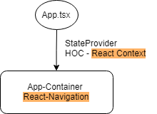
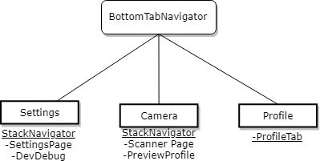
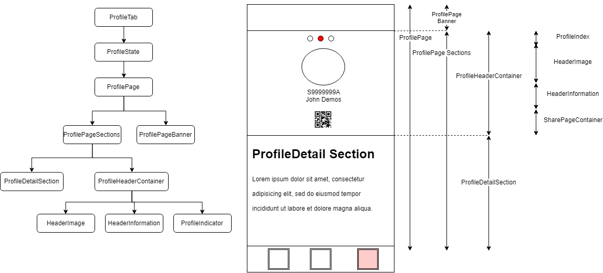

# Luffy Source code documentation

## 📚 Table of Content
  - [Source Folder](#source-folder)
  - [Overview](#overview)
  - [Navigation Overview](#navigation-overview)
  - [Profile Tab Overview](#profile-tab-overview)

## 📁  Source Folder 
These are the folders within the `src` folder at root 
- [`assets`](../src/assets) Picture assets that the mobile app uses
- [`components`](../src/components) React components arranged in navigation format
- [`config`](../src/config) Contains the constants and function to acquire dimensions for phone sizes 
- [`helpers`](../src/helpers) Helper functions 
- [`navigation`](../src/navigation) React-navigation files stored here
- [`services`](../src/services) Contains two REST calls under transferAPI and verificationService, and the rest are local services such as crypto.
- [`state`](../src/state) Initial state, reducers implemented here using React-Context
- [`test`](../src/test) Contains test fixtures such as sample certificates

## ☁️ Overview

This app injection starts at App.tsx, where it will call App Container with a Higher Order Component (HOC). In this mobile app we are using the two most well used libaries, `react-navigation` and `react-context` to give us control over navigating and redux kind of application state management. 

## 🗺 Navigation Overview

The app container contains a bottom tab navigator that is made out of three tabs, [Settings](../src/components/Settings),[Camera](../src/components/Camera) and [Profile](../src/components/Profile). 

Settings and Camera are StackNavigator, allowing them to switch stacks between the above pages, while the profile tab has only just one page. 

> Note: PreviewProfile uses components that are common with screens under ProfileTab.

## 👱 Profile Tab Overview

The profile tab is a complicatd component as it serves the most functions amongst the three tabs. Above shows how the react component tree is arranged. 

Starting from the top, the following will explain its basic functions of the **smart components**
- `ProfileState` Selects the chosen profile to display 
- `Profilepage` Calls verification service to update profile status and `ProfilePageBanner`
- `ProfilePageBanner` Contains messages to display to users AND the status of the current profile
- `ProfilePageSections` Wraps `ProfileHeaderContainer` with swiping library, and manages the swipe callbacks
- `ProfileHeaderContainer` contains the selectPhotoImage for displaying the next and previous profiles stored in the phone

The rest are **dumb components**
- `ProfileDetailSection`
- `HeaderImage`
- `HeaderInformation`
- `ProfileIndicator` 
